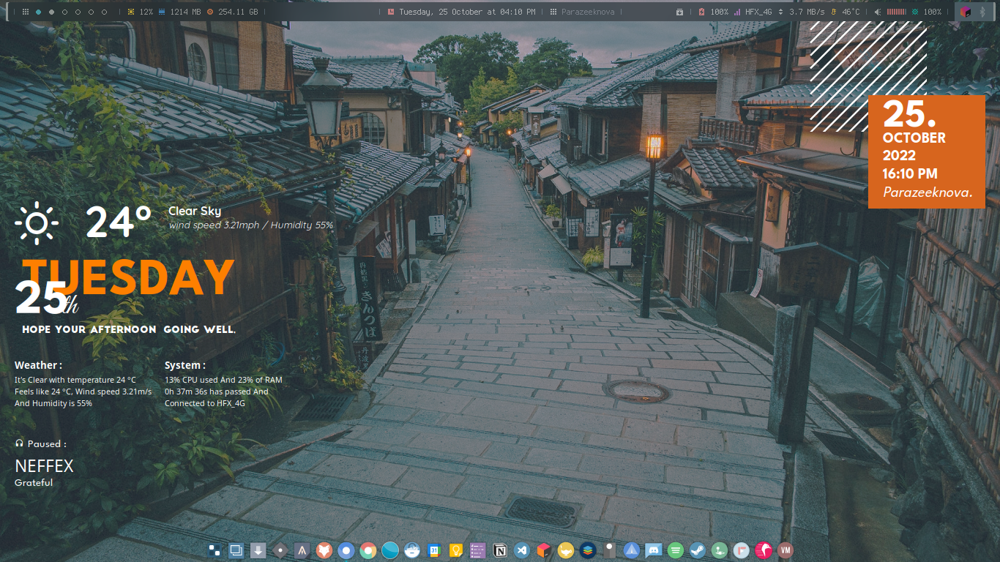

<h1 align="center">🌊 Bitwise Blur Waves Dotfiles :</h1>

> ✨ Inspired/fork/edit from ***Bitwise-forest*** theme by [***adi1090x***](https://github.com/adi1090x) from his Arch distro [***Archcraft-os***](https://github.com/archcraft-os/archcraft).
- 💻 Linux Configuration by [*parazeeknova*](https://github.com/parazeeknova).
- 📌 Posted on [*r/unixporn*](https://www.reddit.com/r/unixporn/comments/x0pa62/openbox_bitwise_blur_waves_first_rice/?utm_source=share&utm_medium=web2x&context=3). (***Now slightly edited***)

 Screenshot 🎞️ 

---

## 🌏 Overview :
- **Operating System** : [`Archcraft`](https://archcraft.io/)
- **Window Manager** : [`Openbox`](http://openbox.org/wiki/Main_Page)
- **Status Bar** : [`Polybar`](https://github.com/polybar/polybar)
- **Widgets** : [`Conky`](https://github.com/brndnmtthws/conky)
- **Launcher** : [`Rofi`](https://github.com/davatorium/rofi)
- **Session Manager** : [`SDDM`](https://wiki.archlinux.org/title/SDDM)
- **Notifications** : [`Dunst`](https://github.com/dunst-project/dunst)
- **Terminal** : [`Alacritty`](https://github.com/alacritty/alacritty)
- **File Manager** : [`Thunar`](https://wiki.archlinux.org/title/thunar) [`Ranger`](https://github.com/ranger/ranger)
- **Compositor** : [`Picom`](https://github.com/yshui/picom) 
- **Web Browser** : `Firefox`

## 🪜 Installation : 
Tommorow
